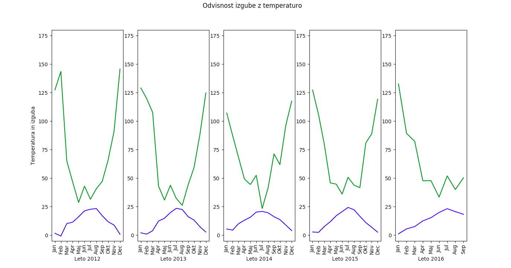
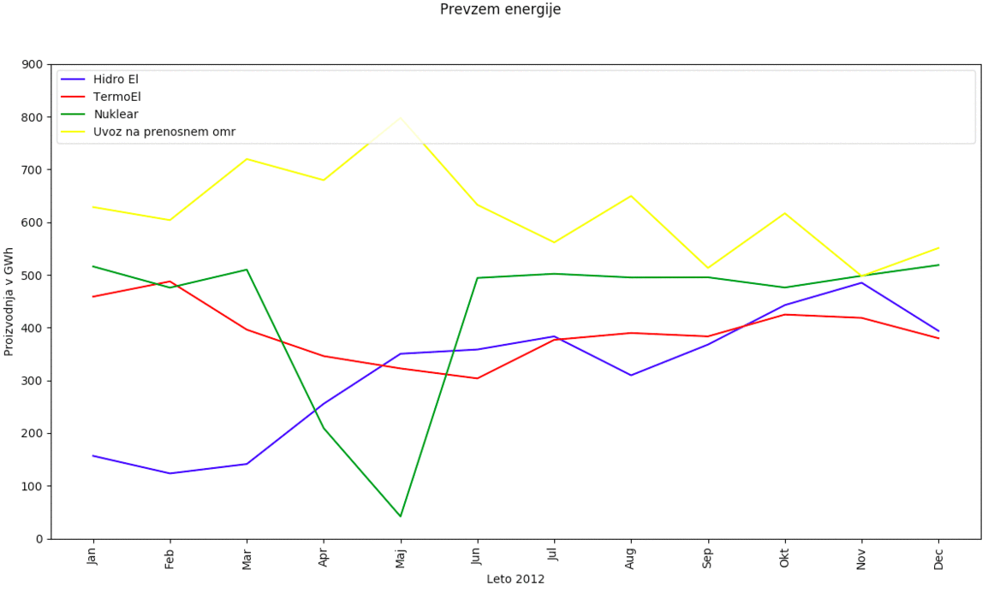
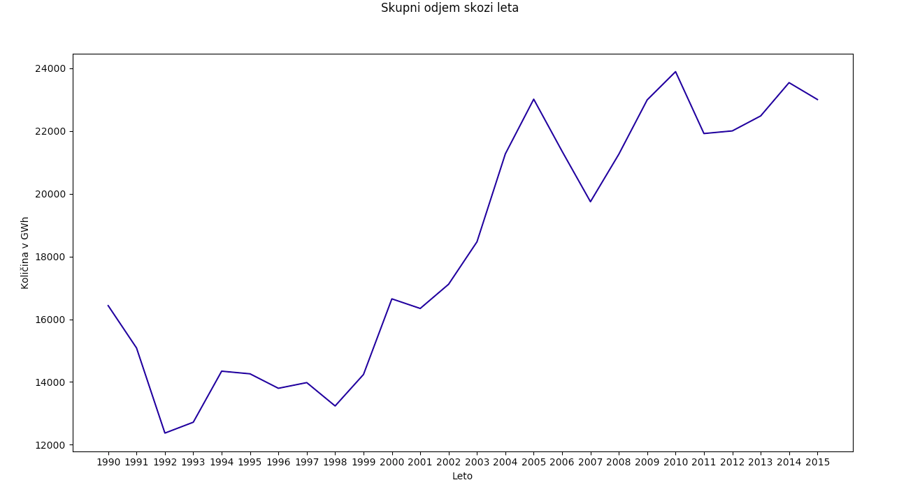
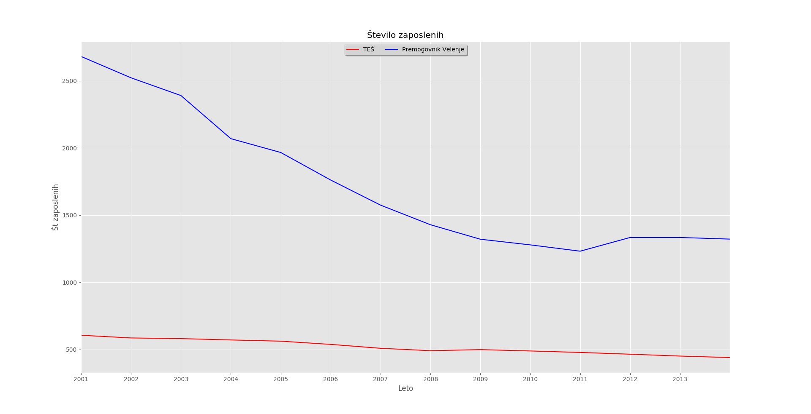

# Analiza področja Energetike

### Uvod

Energija je izjemno pomembna za naš obstoj. Viri le-te definirajo tudi stopnjo razvoja naše civilizacije. Izjemno (viri oziroma načini pridobitve energije) vplivajo na okolje v katerem živimo in seveda tudi na naše “finance”.
Tako smo se s skupino odločili, da analiziramo podatke s področja energetike. Odločili smo se za tri podpoglavja: analiza bilance električne energije, analiza cene električne energije in analiza gibanja zaposlenih v elektrogospodarstvu, premogovništvu oziroma analiza kadra.
Prej omenjena področja bomo prvo predstavili posamezno nato pa v zaključku teme medseboj še povezali (naprimer: kakšno je razmerje med bilanco energije in ceno elektrikčne energije, gibanje zaposlenih v primerjavi s ceno ali bilanco).

Za uvod bomo predstavil gibanje izkopa premoga. Pridobivanje fosilnih goriv in proces pridobivanja energije iz teh fosilnih goriv, je postala pereča tema današnjega sveta. Saj naj bi ta proces vplival na globalne podnebne spremembe in kvaliteto zraka. 

Na grafu lahko razberemo, da je večino premoga, ki ga izkopljemo v Sloveniji - rjavi premog ali lignit. Izkop rjavega premoga se v odvisnosti od časa zmanjšuje, medtem ko ima lignit dvig in nato padec, a še vedno ostaja kar visoko. Lignit se predvsem izkopava v Velenju in uporablja kot vir energije v TEŠ. Črni premog smo pridobivali v Sečovljah, a smo ga kasneje opustili. Izkop je bil majhen, okoli nekaj 10 000 ton letno. 

### Podatki

Podatki so na voljo na OPSI spletni strani: povezava do podatkov http://www.energetika-portal.si/statistika/ . Večinoma so se uporabljali naslednji tematski sklopi, iz katerih smo nato s poizvedbami na spletni strani sestavili tabelo in jo prenesli na naše sisteme: 

1. trdna goriva
   1. izkop in energija izkopanega premoga

2. električna energija - količine
   2. Bilanca električne energije na omrežju (MWh), Slovenija, mesečno
   2. Bilanca električne energije na omrežju (GWh), Slovenija, letno
   2. Dejanska Delovna moč elektrarn (MW), Slovenija, letno

3. električna energija - cene
   3. Cene električne energije za gospodinjstva - standardne porabniške skupine (EUR/MWh), Slovenija, letno
   3. Cene električne energije za gospodinjstva - standardne porabniške skupine (EUR/MWh), Slovenija, četrtletno

4. investicije
   4. Investicijska vlaganja v energetske objekte (EUR), Slovenija, letno

5. subvencije
   5. Subvencionirana proizvodnja električne energije iz obnovljivih virov energije in v soproizvodnji z visokim izkoristkom, Slovenija, letno
   5. Subvencionirana proizvodnja električne energije iz domačih virov za zagotavljanje zanesljive oskrbe z električno energijo, Slovenija, letno

6. zaposleni
   6. elektrogospodarstvo
   6. premogovništvo

Podatki imajo občasno različne začetke in konce meritev (katerega leta se je meritev začela, katerega leta se je končala). Imajo manjkajoče podatke, ki so oznaženi z .. (dve piki). Te smo sfiltirarli ven - np.nan.
Vsi podatki so številski.

## Analiza cene električne energije

### Uvod

Odločil sem se da analiziram sestavo cene električne energije in kasneje še pogledam kako se cena primerja z ostalimi področji.
### Podatki
Podatke sem prebral s pomočjo DictReaderja in manjkajoče vrednosti .. zamenjam z numpy not a number vrednostjo ter jo nato
v analizah/izrish korektno obravnaval. Uporabil sem podatke o cenah električne energije, subvencije in investicij.

Iz grafa je razvidno, da se je cena v 10ih letih povečala iz 100 evrov/MWh na 160 evrov/MWh.
Povečale so se vse komponente cene (to so omrežnina, davek, dajatve, energija in trošarina). Zvišanje cene energije in dajatev močno korelira s subvencijami. Poglejmo naslednje korelacijske vrednosti. 
Energija: 
1. porabniska skupina:  DA (< 1.000 kWh)  korelacija:  (0.72386550066987743, p 0.011784684117952761)
2. porabniska skupina:  DE ( >= 15.000 kWh)  korelacija:  (0.52538249246762048, p 0.096979314003151351)
3. porabniska skupina:  D - Slovenija  korelacija:  (0.75818531048947568, p 0.0068476637652090337)

Dajatve:
1. porabniska skupina:  DA (< 1.000 kWh)  korelacija:  (0.79361988513310644, p 0.0035473215159415703)
2. porabniska skupina:  DE ( >= 15.000 kWh)  korelacija:  (0.68177809278065515, p 0.02085331804452565)
3. porabniska skupina:  D - Slovenija  korelacija:  (0.8991564671994442, p 0.00016592573496423867)

Vidimo da cena energija močno korelira s subvencijami obnovljivih virov. Predvsem D - Slovenija (povprečje vseh porabniških skupin) in najmanjši porabniki. Podobno velja za dajatve, le da je tukaj korelacija s subvencijami še močnejša. Cena energije in dajatev za največje porabnike najmanj korelira s subvencijami ( srednje močna koreliranost). 

Prikaz sestave cene na drugačen način (vrednosti naložene druge na drugo in tako tvori najvišja krivulja kar višino končne cene). 

Graf prikazuje odstopanje končne cene od povprečne končne cene energije zadnjih 10 let. Vidimo, da. Dodaten dokaz višanja cene električne energije. 

Prikaz gibanja deležev posameznih komponent končne cene. Vidimo da se je delež cene, ki ga predstavljajo dajatve znatno povečal. Prav tako se je povečal davek. 

(na grafu je napaka pri izpisu vrednosti na stolpcih - zaradi napake v formatu so vrednosti čez 100 odrezane, manjkajo enice)
Graf prikazuje gibanje komponent cene za vsako porabniško skupino. Prvo opažanje je, da večji porabniki plačajo manj na MWh. Drugo opažanje je, da najmanjši porabniki plačajo vsak del cene več kot največji porabniki - z izjemo trošarine. Zanimivo je tudi zvišanje cene. Za najmanjše porabnike se je cena zvišala s približno 150-160 evrov na MWh na približno 275 evrov na MWh - zvišanje za približno 77%.
Pri največji porabnikih je zvišanje le z 80 evrov na 125 evrov (približno), zvišanje za 56%.

Na zgornjem grafu lepo vidimo deleže, ki ga predstavljajo posamezne komponente cene električne energije. Zanimive so razlike v deležu cene dajatev. Delež dajatev je pri najmanjših porabnikih kar 21% (leto 2015), največji porabniki le 3%. 

Gibanje subvencij v EUR na MWh. Po letu 2009 se subvencije za obnovljive vire in vire z visokim izkoristkom zelo povečajo. Vidimo tudi subvencije elektrarnam, ki uporabljajo premog iz premogovnika Trbovlje. Te so zelo nizke in padajo. Po letu 2012 ni več podatkov. 
Zanimive so tudi sončne elektrarne, ki so eden najbolj subvencioniranih obnovljivih virov - čez 300 evrov na MWh. Visoka subvencije za sončne elektrarne pa ne vplivajo na povišanje subvencij za obnovljive vire, saj so subvencije za sončne elektrarne v primerjavi z vsemi obnovljivimi viri padle. 

Graf prikazuje nekaj primerov najvišjih subvencij.

Graf prikazuje količino subvencij  v evrih. Levi graf prikazuje gibanje subvencij, sredinski doda še dodatno komponento - investicije. Tretji skalo pretvori v logaritemsko, da lažje vidimo spremembe.
Subvencije (obnovljivih virov) smo že obdelali - konkretno se povečajo po letu 2009. Investicij pa se še nismo dotaknili. Tukaj vidimo predvsem dve zanimivi območji - leto 2007 in leto 2011. Investicije so v teh letih dosegle zelo visoko vrednost - leto 2006 je vrednost približno 0.3 * 10^9, leta 2007  1.75 * 10^9. Skok za več kot 1.45 milijarde evrov. 
Pri pregledu različnih elektrarn je bilo opaziti podoben model pri vseh. Povišanje amortizacije in kreditov (dve pomembnejši komponenti, poleg lastnih sredstev. Ostale komponente : ostala sredstva in povprečni stroški priključevanja) leta 2007, nato padec in potem ponovni “manjši” vzpon. Zakaj ravno leta 2007? Nekaj zanimivih informacij, ki mogoče lahko pojasnejo situacijo. Po letu 2005 se je povečala likvidnost na finačnih trgih (ob visoki gospodarski rasti). Tako so se mnoga podjetja začela zadolževati. Od leta 2007 do 2008 se je gospodarstvo dodatno zadolžilo da 3 milijarde evrov (skupni obseg kreditov se je povečal z 28.3 na 33.3 milijarde evrov, vir: Dnevnik, https://www.dnevnik.si/1042246295). Ne smemo pozabiti omeniti tudi pregrešno dragega projekta TEŠ6, ki bi tudi lahko bil eden od vzrokov povišanja investicij - resolucija o nacionalnih razvojnih projektih za obdobje 2007-2023.

Zanimive so naslednje korelacije: investicija ne korelira s kočno ceno:
Korelacija investicij ter koncne cene (-0.1307414096552979, p 0.70159954201736052)

Medtem ko obnovljivi viri močno korelirajo s končno ceno.
Korelacija subvencij obnovljivih virov in SPTE ter koncne cene (0.9020608764310194, p 0.00014610864766170738)
Subvencija elektrarn, ki uporabljajo premog iz rudnika trbovlje korelira ravno obratno:
Korelacija subvencij premogovnika ter koncne cene (-0.96800070000529459, p 7.9961297640388697e-05)

### Linearni model
Odločil sem se zgraditi linearni model, ki bi iz investicij, subvencij obnovljivih virov, moči elektrarn in porabe energije (gospodinjstva) poskušal napovedati končno ceno. Podatkov je malo, približno 10 primerov, zato sem se odločil, da bom model zgradil večkrat iz x podatkov in ga uporabil za napovedovanje primera, ki ni bil v x. Podatki so časovni, zato sem uporabil za učenje modela le podatke, pred primerom, ki sem ga hotel napovedati. To sem ponovil k krat, napake - srednja absolutna napaka in srednja kvadratna napaka, sem na koncu normaliziral s številom izvedb (povprečje).

Model sem zgradil za več alfa vrednosti (Lasso, Ridge) in vse podmnožice atributov. V “if” stavku sem si nato zapomnil le najboljši model in parametre, ki so bili uporabljeni za izgradnjo.
Najboljši model je bila linearna regresija Lasso s parametrom alpha=39.9. Srednja absolutna napaka je bila 7.28, kvadratna napaka je bila 133.01, koren iz kvadratne napake je bil 11.53. Za učenje sta bila uporabljena 2 atributa - moč elektrarn in poraba energije.
Alfa vrednost določa stopnjo regularizacije. Regularizacija je kaznovanje kompleksnih modelov, da dosežemo čim manjše parametre (v geometrijskem smislu).

Korelacija cene in moci elektrarn (0.9429085307122419, p 1.3680433898470748e-05)

Odstopanje modela je približno 7 evrov na MWh - cena se giblje v vrednostih čez 100 evrov na MWh in ocenjujem, da napaka ni velika.

Srednja absolutna napaka, kvad_napaka, kvad_napaka koren, najboljsi subset atributov za napoved, vrednost alpha, model :  7.27980276492 133.011179176 11.533047263222416 [2, 3] 39.9 Lasso(alpha=39.900000000000006, copy_X=True, fit_intercept=True,
   max_iter=1000, normalize=False, positive=False, precompute=False,
   random_state=None, selection='cyclic', tol=0.0001, warm_start=False)

## Zaključek

Po vseh prikazih podatkov lahko z neko stopnjo gotovosti zaključim, da je cena električne energije zelo povezana z gibanjem subvencij obnovljivih virov. Državljani s plačilom elektrike plačamo poleg trošarine, dejanske pridobitve energije in vzdrževanje omrežja tudi razvoj in gradnjo novih energetskih objektov - to pa so predvsem obnovljivi viri energije. 

## Navezava druge teme

Iz grafa je razvidno, da se število zaposlenih v elektrogospodarstvu načeloma zmanjšuje, kar potrdi tudi naslednji graf.

Razmerje med ceno in zaposlenimi se viša: razlog število zaposlenih se počasi manjša - cena pa se povečuje hitro. 

Razmerje med bilanco električne energije in zaposlenimi se veča - število zaposlenih se manjša, pridobivanje energije se veča. To je le razmerje, veliko bolj vredno bi bilo razmerje med zaposlenimi v premogovništvu in izkopom (glej analizo kadra).

Razmerje med ceno in bilanco električne energije. Cena se hitreje viša kot dejanska pridobitev električne energije, zato se razmerje povečuje.

Graf prikazuje zanimivo opazko med Elektro “podjetji”. Leta 2004 se namreč veliko vrednosti skoraj zasuka in nato spet vrnejo na “normalne” vrednosti. Ostala dva (desna) grafa prikazujeta seštevek zaposlenih, vidimo, da se je število zaposlenih takrat zmanjšalo dejansko le za približno 150. Je mogoče napaka v podatkih ali kakšno prekustruriranje podjetji. 

## Bilanca elektricne energije

### Opis problema:
Zanima nas kolicina proizvedene energije v sloveniji in njena poraba skozi leta ter ker so glavni viri elektricne energije za slovenski trg.

### Podatki:

Pri analizi bilance elektricne energije sem uporabil podatke iz datotek bilancaLeto.csv(vsebuje podatke o virih letno) in	bilancaMesec.csv(vsebuje podatke za vsak mesec od 2012 do 2016, zato so na nekaterih vizualizacijah tudi z temi leti omejeni podatki).

Uporabil tudi uradne informacije iz strani [NEK](http://www.nek.si/sl/novinarsko_sredisce/porocila/mesecna_porocila_o_obratovanju/).

### Analiza
Pri analizi bilance elektricne energije, ko sem naredil prikaz skupnega mesecnega prevzema energije in hkrati dodal izgubo energije na prenosnem omrezju. 

Opazi se, da izguba ni nic koelirala z skupni prevzemom,zato sem se odlocil in raziskal malo, ter primerjal izgubo z povprecno temperaturo skozi leta za vsak mesec in opazil da z temperaturo pa koelira (kot lahko vidite na spodnjem grafu). Iz tega grafa in podatkov zato sklepam da se to zgodi zaradi temparature in fizicnih karakteristik vodnikov ter ostalih vplivov na električno omrežje(nenadna velika poraba, gretje vodnikov, izguba v navitjih, ipd.)

Iz podatkov je bilo mozno tudi dobiti informacije o mesecnem prevzemu in odjemu elektricne energije ter tudi kolicina, koliko energije proizvedejo naše elektrarne. Ko sem naredil nekaj vizualizacij, sem opazil da glavni viri energije za naše omrežje so Jedrska elektrarnaKrško, Hidro elektrarne, termo elektrarne in elektrika katero uvozimo. Zato sem se osredotočil samo na te štiri in opazil "spike" v proizvodnji jedrske elektrarne krško. Izkazalo se je, da so tej "spiki" nastali zaradi remonta v elektrarni. Zelo lepo je tudi razvidno, kako je velik delež vira energije za naše omrežje jedrska elektrarna in kako ob manjši proizvodnji, ostale elektrarne prevzamejo breme in tudi uvoz se poveca.

Posamezni graf:
- [Leto 2012](bilanca_elek_energije/img/sprememba2012.png)
- [Leto 2013](bilanca_elek_energije/img/sprememba2013png)
- [Leto 2014](bilanca_elek_energije/img/sprememba2014png)
- [Leto 2015](bilanca_elek_energije/img/sprememba2015png)
- [Leto 2016](bilanca_elek_energije/img/sprememba2016png)

Za zaključek se mi je pa zdela zelo zanimiva še tale vizualizacija ki prikazuje skupni odjem skozi leta, od leta 1990 do 2015. Zanimivo je kako od osamosvojitve naprej raste poraba, in kako se strmo poveca od leta 1998 do 2005. Predvidevam da padec porabe od leta 2005 do 2007 se zgodi zarad takratne financne krize ki se je zgodila pri nas. 

## Analiza kadra
### Opis problema:
Zanima nas gibanje kadra v premogovnikih in termoelektrarnah, ter primerjava med njimi. Deleži kadra po izobrazbi, vpliv subvencij na število zaposlenih in tako naprej. Podatke primerjamo tudi z količino izkopangea premoga skozi leta.
### Podatki:
Podatke sem si pripravil iz zgoraj omenjenih tabel. Nahajajo se v datotekah:
- RHRASTNIK-kader-leta.csv
- RTRBOVLJE-izkop-leta.csv
- RVELENJE-izkop-leta.csv
- RVELENJE-kader-leta.csv
- subvecnije_rud_trbov_hrastnik_rjavi_premog.csv
- TES-kader-leta.csv
### Analiza:
Na spodnjem grafu vidimo povprečen delež kadra v premogovniku Velenje. Podatki so od leta 2001 do 2014. Iz grafa je razvidno, da ima največji delež zaposlenih končano 3 ali 4 letno srednjo šolo (več kot 3/4). Zelo malo je magistrov in doktorjev znanosti, kar pa je bilo pričakovano.

Enako naresdimo še za termoelektrarno Šoštanj. Vidimo, da je več magistrov in doktorjev kot pri prejšnjem grafu a večinski delež ima še vedno 3 in 4 letna srednja šola.

Nato si pogledamo kako se je spreminjalo število zaposlenih premogovniku Velenje skozi čas. Vidimo da število zaposlenih kar hitro pada, od leta 2001 do 2014 se je število zaposlenih skoraj razpolovilo.

Tudi v termoelektrarni Šoštanj je število zaposlenih padlo

Primerjamo samo skupno število zaposlenih termoelektrarne Šoštanj ter Premogovnika Velenje. Število zaposlenih v rudniku Velenje je do leta 2011 padalo zelo hitro, potem pa počasneje med tem ko v termoelektrarni Šoštanj skoraj konstantno poačsi pada. 

Na voljo so bili tudi podatki o subvencijah in sicer: sofinanciranje upravičenih stroškov izbranih proizvajalcev električne energije, ki so v določenem obsegu prevzeli obveznost uporabe domačega vira primarne energije za zagotavljanje zanesljive oskrbe z električno energijo. 
Domači energent je rjavi premog iz rudnika Rudnik Trbovlje-Hrastnik d.o.o.. Zanimalo nas je, če višina subvencije kako posredno vpliva na število zaposlenih v premogovniku Hrastnik

Ker število zaposlenih v vseh premogovnikih pada, nas je zanimalo če se je zmanjševal tudi izkop premoga. Izkop premoga se skorj ni spremenil, kar pomeni, da se je povečal izkop premoga na zaposlenega. Podatki o izkopu so navoljo do leta 2011. Vidimo da je v obeh premogovnikih izkop premoga na zaposlenega močno zrastel.

Nadaljna raziskava pokaže da število zaposlenih v rudnikih in premogovnikih pada zaradi avtomatizacije, kar se zdi logočino, glede na to da vsako leto izkopljejo skoraj enako količino premoga. 

# Izjava o izdelavi domače naloge
Domačo nalogo in pripadajoče programe smo izdelali sami.

