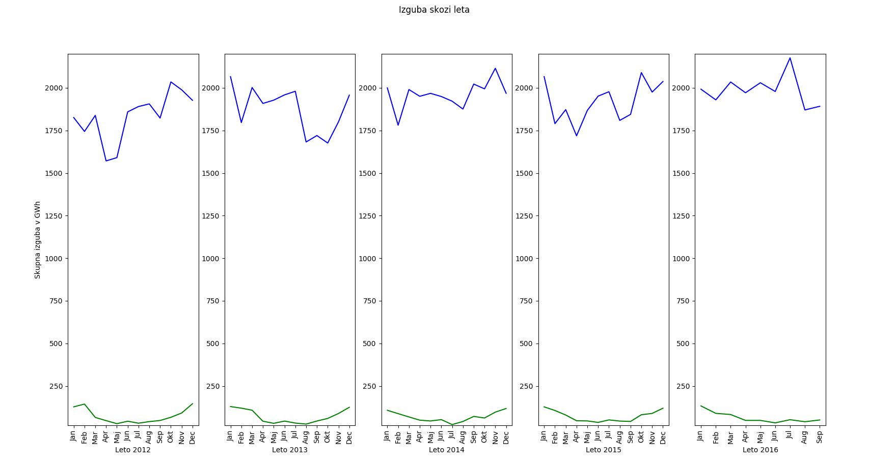

# PR17JSPLJP
Skupina za podatkovno rudarjenje - seminarska naloga (tema) Analiza Energetike

Odločili smo se, da bomo analizirali podatke s področja energetike. Podatki
so na voljo na OPSI oziroma povezave s prej omenjene strani vodijo do podatkov na: http://www.energetika-portal.si/statistika/ Podatki so sestavljeni iz več tabel. Izbrali bomo večino le-teh, jih analizirali in
poskusili priti do zanimivh korelacij in vizualnih prikazov področja energetike pri nas.

Osredotočili se bomo na naslednje teme: cene, pridobivanje, poraba, spremembe vrst virov, (kako se, če se, spreminja poraba/pridobivanje določenih virov energije. Kako se spreminjajo tržni deleži in ostale finančno povezane teme (investicije, subvencije) ter število zaposlenih glede na prej omenjeno) ...

-dodaj podnaloge in točke za pomoč pri vmesni predstavitvi

Analiza kadra

Analiza cene

Bilanca električne energije

