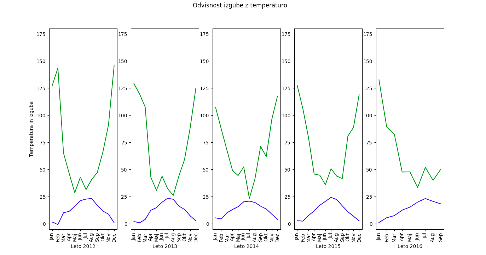
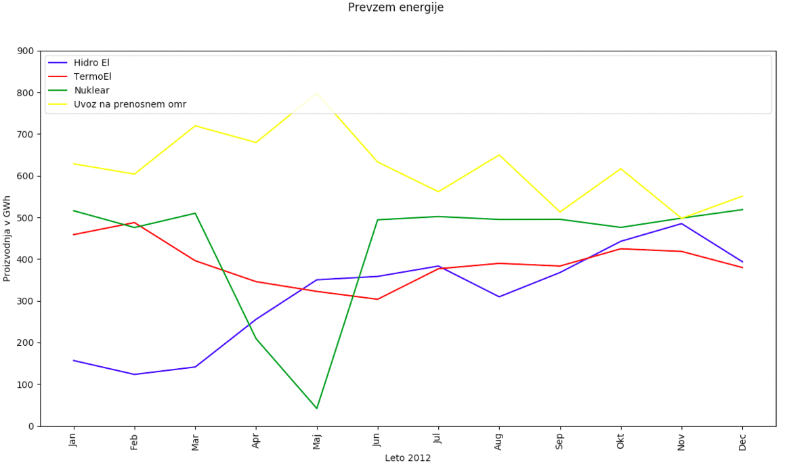
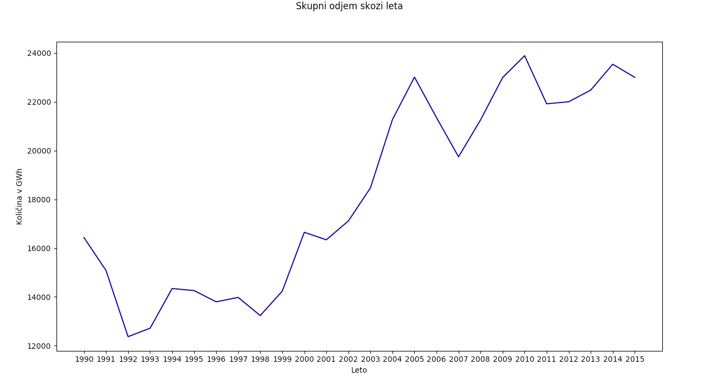

## Bilanca elektricne energije

### Opis problema:
Zanima nas kolicina proizvedene energije v sloveniji in njena poraba skozi leta ter ker so glavni viri elektricne energije za slovenski trg.

### Podatki:

Pri analizi bilance elektricne energije sem uporabil podatke iz datotek bilancaLeto.csv(vsebuje podatke o virih letno) in	bilancaMesec.csv(vsebuje podatke za vsak mesec od 2012 do 2016, zato so na nekaterih vizualizacijah tudi z temi leti omejeni podatki).

### Analiza
Pri analizi bilance elektricne energije, ko sem naredil prikaz skupnega mesecnega prevzema energije in hkrati dodal izgubo energije na prenosnem omrezju. 

Opazi se, da izguba ni nic koelirala z skupni prevzemom,zato sem se odlocil in raziskal malo, ter primerjal izgubo z povprecno temperaturo skozi leta za vsak mesec in opazil da z temperaturo pa koelira (kot lahko vidite na spodnjem grafu). Iz tega grafa in podatkov zato sklepam da se to zgodi zaradi temparature in fizicnih karakteristik vodnikov ter ostalih vplivov na električno omrežje(nenadna velika poraba, gretje vodnikov, izguba v navitjih, ipd.)

Iz podatkov je bilo mozno tudi dobiti informacije o mesecnem prevzemu in odjemu elektricne energije ter tudi kolicina, koliko energije proizvedejo naše elektrarne. Ko sem naredil nekaj vizualizacij, sem opazil da glavni viri energije za naše omrežje so Jedrska elektrarnaKrško, Hidro elektrarne, termo elektrarne in elektrika katero uvozimo. Zato sem se osredotočil samo na te štiri in opazil "spike" v proizvodnji jedrske elektrarne krško. Izkazalo se je, da so tej "spiki" nastali zaradi remonta v elektrarni. Zelo lepo je tudi razvidno, kako je velik delež vira energije za naše omrežje jedrska elektrarna in kako ob manjši proizvodnji, ostale elektrarne prevzamejo breme in tudi uvoz se poveca.

Posamezni graf:
- [Leto 2012](bilanca_elek_energije/img/sprememba2012.png)
- [Leto 2013](bilanca_elek_energije/img/sprememba2013png)
- [Leto 2014](bilanca_elek_energije/img/sprememba2014png)
- [Leto 2015](bilanca_elek_energije/img/sprememba2015png)
- [Leto 2016](bilanca_elek_energije/img/sprememba2016png)

Za zaključek se mi je pa zdela zelo zanimiva še tale vizualizacija ki prikazuje skupni odjem skozi leta, od leta 1990 do 2015. Zanimivo je kako od osamosvojitve naprej raste poraba, in kako se strmo poveca od leta 1998 do 2005. Predvidevam da padec porabe od leta 2005 do 2007 se zgodi zarad takratne financne krize ki se je zgodila pri nas. 

