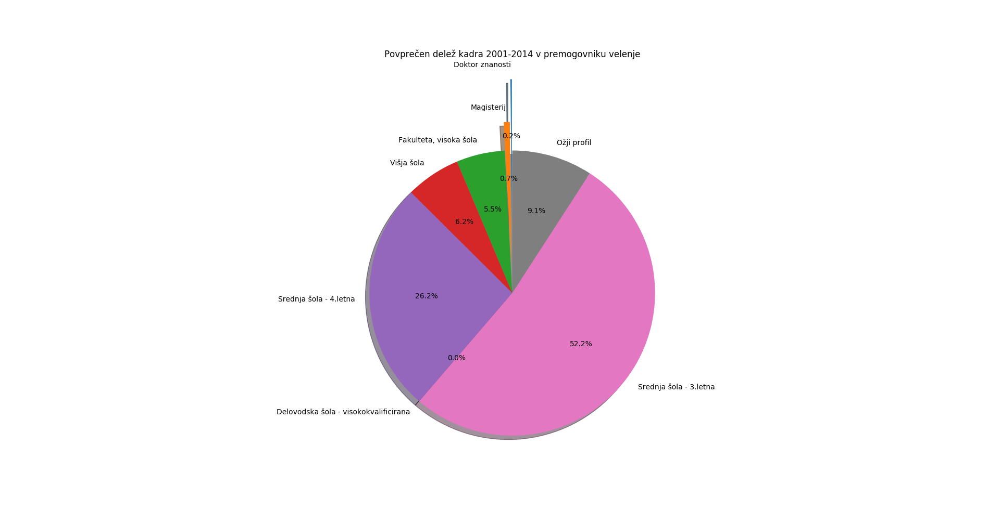
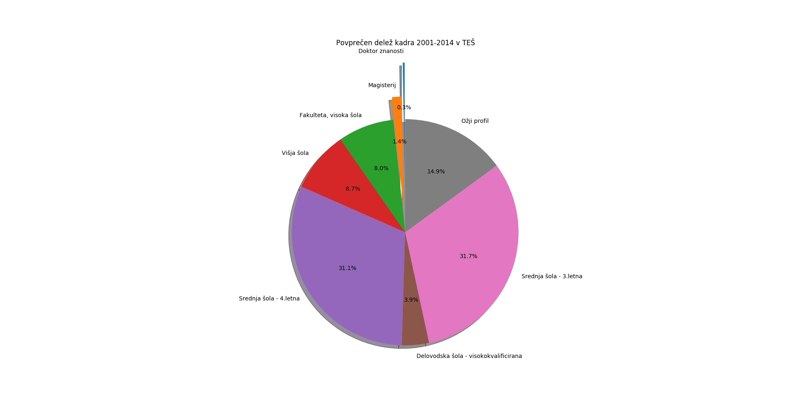
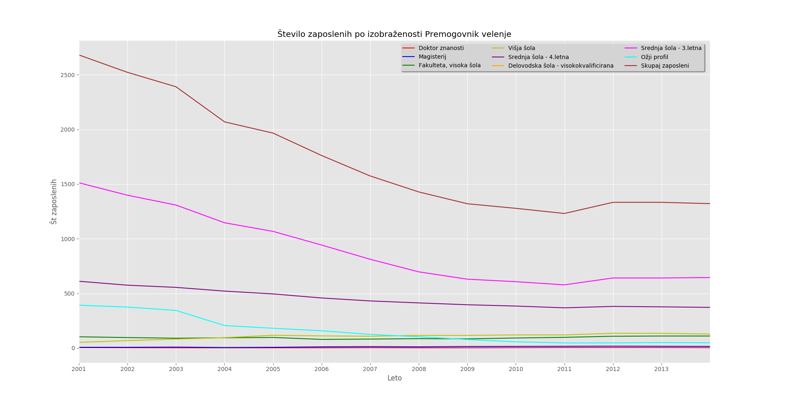
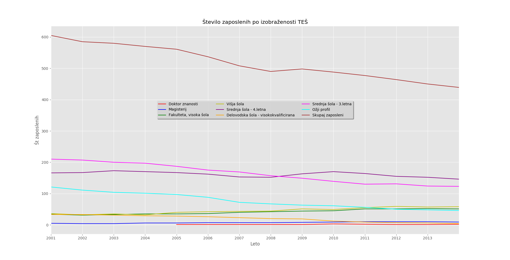
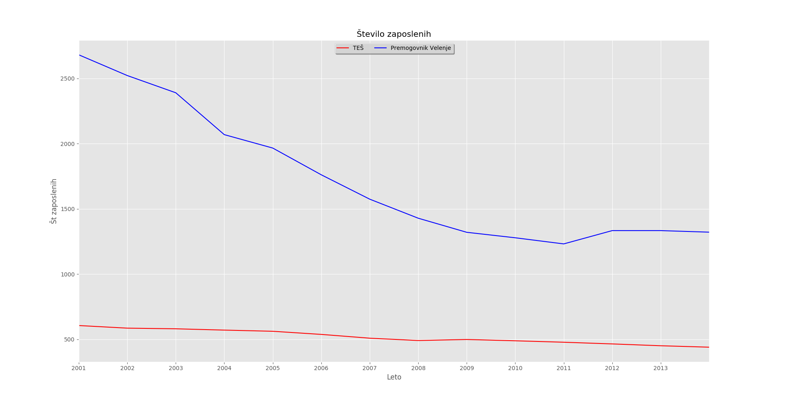
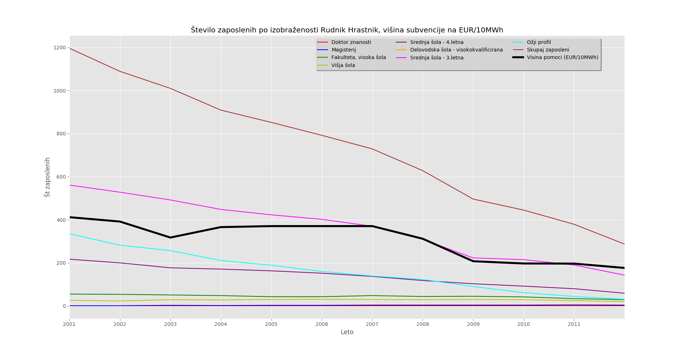
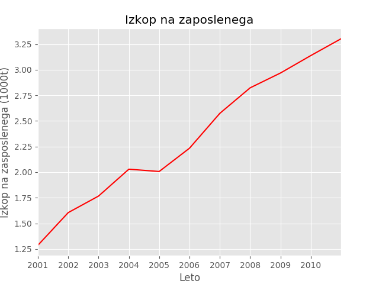
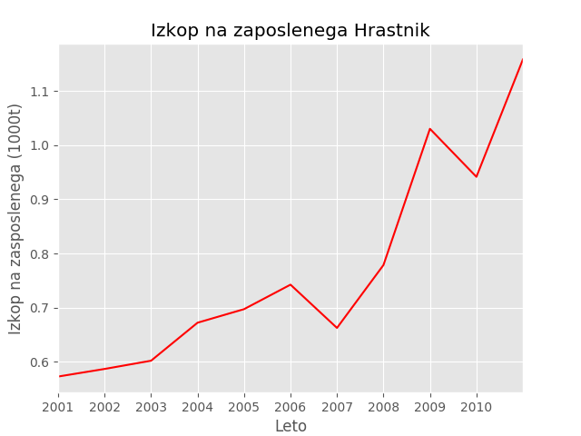

## Analiza kadra
###Opis problema:
Zanima nas gibanje kadra v premogovnikih in termoelektrarnah, ter primerjava med njimi. Deleži kadra po izobrazbi, vpliv subvencij na število zaposlenih in tako naprej. Podatke primerjamo tudi z količino izkopangea premoga skozi leta.
###Podatki:
Podatke sem si pripravil iz zgoraj omenjenih tabel. Nahajajo se v datotekah:
- RHRASTNIK-kader-leta.csv
- RTRBOVLJE-izkop-leta.csv
- RVELENJE-izkop-leta.csv
- RVELENJE-kader-leta.csv
- subvecnije_rud_trbov_hrastnik_rjavi_premog.csv
- TES-kader-leta.csv
###Analiza:
Na spodnjem grafu vidimo povprečen delež kadra v premogovniku Velenje. Podatki so od leta 2001 do 2014. Iz grafa je razvidno, da ima največji delež zaposlenih končano 3 ali 4 letno srednjo šolo (več kot 3/4). Zelo malo je magistrov in doktorjev znanosti, kar pa je bilo pričakovano.

Enako naresdimo še za termoelektrarno Šoštanj. Vidimo, da je več magistrov in doktorjev kot pri prejšnjem grafu a večinski delež ima še vedno 3 in 4 letna srednja šola.

Nato si pogledamo kako se je spreminjalo število zaposlenih premogovniku Velenje skozi čas. Vidimo da število zaposlenih kar hitro pada, od leta 2001 do 2014 se je število zaposlenih skoraj razpolovilo.

Tudi v termoelektrarni Šoštanj je število zaposlenih padlo

Primerjamo samo skupno število zaposlenih termoelektrarne Šoštanj ter Premogovnika Velenje. Število zaposlenih v rudniku Velenje je do leta 2011 padalo zelo hitro, potem pa počasneje med tem ko v termoelektrarni Šoštanj skoraj konstantno poačsi pada. 

Na voljo so bili tudi podatki o subvencijah in sicer: sofinanciranje upravičenih stroškov izbranih proizvajalcev električne energije, ki so v določenem obsegu prevzeli obveznost uporabe domačega vira primarne energije za zagotavljanje zanesljive oskrbe z električno energijo. 
Domači energent je rjavi premog iz rudnika Rudnik Trbovlje-Hrastnik d.o.o.. Zanimalo nas je, če višina subvencije kako posredno vpliva na število zaposlenih v premogovniku Hrastnik

Ker število zaposlenih v vseh premogovnikih pada, nas je zanimalo če se je zmanjševal tudi izkop premoga. Izkop premoga se skorj ni spremenil, kar pomeni, da se je povečal izkop premoga na zaposlenega. Podatki o izkopu so navoljo do leta 2011. Vidimo da je v obeh premogovnikih izkop premoga na zaposlenega močno zrastel.

Nadaljna raziskava pokaže da število zaposlenih v rudnikih in premogovnikih pada zaradi avtomatizacije, kar se zdi logočino, glede na to da vsako leto izkopljejo skoraj enako količino premoga. 

